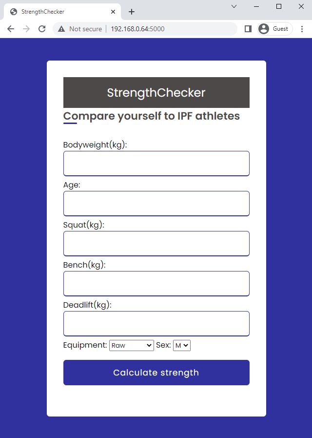
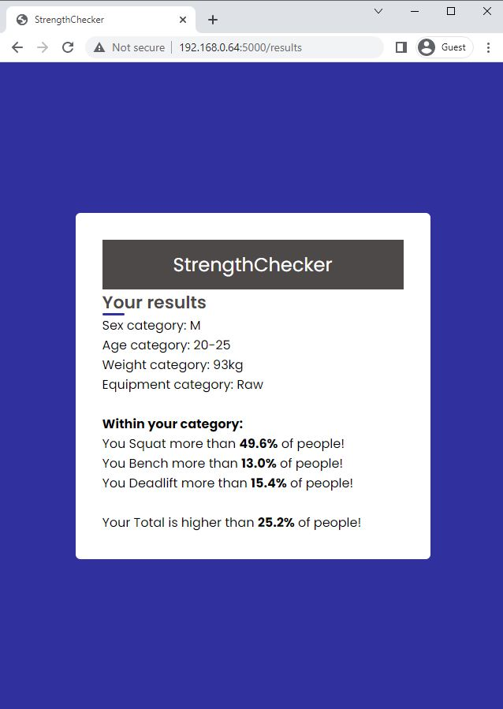

# StrengthChecker

StrengthChecker is a webapplication which enables users to compare their Squat/Bench/Deadlift numbers to people of same sex, age group and weightclass

This service uses data from the OpenPowerlifting project, https://www.openpowerlifting.org.
## Preview of index and result pages

## Steps to run locally
1. pip install -r requirements.txt
2. python app.py

## Steps to run with Docker
1. docker build -t strengthchecker_docker .
2. docker run -p 5000:5000 -d strengthchecker_docker
